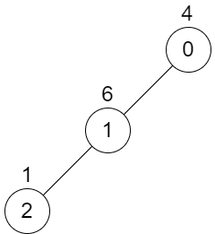

Can you solve this real interview question? Maximum XOR of Two Non-Overlapping Subtrees - There is an undirected tree with n nodes labeled from 0 to n - 1. You are given the integer n and a 2D integer array edges of length n - 1, where edges[i] = [ai, bi] indicates that there is an edge between nodes ai and bi in the tree. The root of the tree is the node labeled 0.

Each node has an associated value. You are given an array values of length n, where values[i] is the value of the ith node.

Select any two non-overlapping subtrees. Your score is the bitwise XOR of the sum of the values within those subtrees.

Return the maximum possible score you can achieve. If it is impossible to find two nonoverlapping subtrees, return 0.

Note that:

 * The subtree of a node is the tree consisting of that node and all of its descendants.
 * Two subtrees are non-overlapping if they do not share any common node.

 

Example 1:

Input: n = 6, edges = [[0,1],[0,2],[1,3],[1,4],[2,5]], values = [2,8,3,6,2,5]
Output: 24
Explanation: Node 1's subtree has sum of values 16, while node 2's subtree has sum of values 8, so choosing these nodes will yield a score of 16 XOR 8 = 24. It can be proved that is the maximum possible score we can obtain.

Example 2:

Input: n = 3, edges = [[0,1],[1,2]], values = [4,6,1]
Output: 0
Explanation: There is no possible way to select two non-overlapping subtrees, so we just return 0.

 

Constraints:

 * 2 <= n <= 5 * 104
 * edges.length == n - 1
 * 0 <= ai, bi < n
 * values.length == n
 * 1 <= values[i] <= 109
 * It is guaranteed that edges represents a valid tree.

---

## Images

- Image 1: `image_1.png`
- Image 2: `image_2.png`
