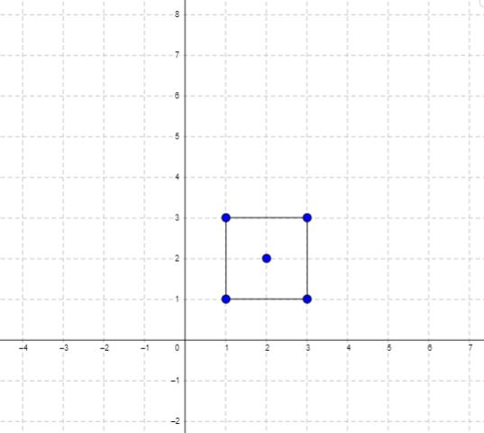

Can you solve this real interview question? Minimum Area Rectangle - You are given an array of points in the X-Y plane points where points[i] = [xi, yi].

Return the minimum area of a rectangle formed from these points, with sides parallel to the X and Y axes. If there is not any such rectangle, return 0.

 

Example 1:

Input: points = [[1,1],[1,3],[3,1],[3,3],[2,2]]
Output: 4

Example 2:

Input: points = [[1,1],[1,3],[3,1],[3,3],[4,1],[4,3]]
Output: 2

 

Constraints:

 * 1 <= points.length <= 500
 * points[i].length == 2
 * 0 <= xi, yi <= 4 * 104
 * All the given points are unique.

---

## Images

- Image 1: `image_1.png`
- Image 2: `image_2.png`
