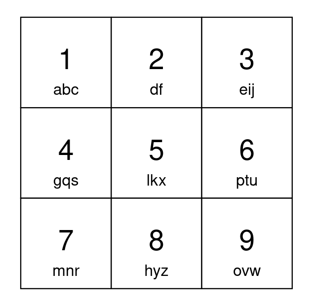

Can you solve this real interview question? Minimum Number of Keypresses - You have a keypad with 9 buttons, numbered from 1 to 9, each mapped to lowercase English letters. You can choose which characters each button is matched to as long as:

 * All 26 lowercase English letters are mapped to.
 * Each character is mapped to by exactly 1 button.
 * Each button maps to at most 3 characters.

To type the first character matched to a button, you press the button once. To type the second character, you press the button twice, and so on.

Given a string s, return the minimum number of keypresses needed to type s using your keypad.

Note that the characters mapped to by each button, and the order they are mapped in cannot be changed.

 

Example 1:

Input: s = "apple"
Output: 5
Explanation: One optimal way to setup your keypad is shown above.
Type 'a' by pressing button 1 once.
Type 'p' by pressing button 6 once.
Type 'p' by pressing button 6 once.
Type 'l' by pressing button 5 once.
Type 'e' by pressing button 3 once.
A total of 5 button presses are needed, so return 5.

Example 2:

Input: s = "abcdefghijkl"
Output: 15
Explanation: One optimal way to setup your keypad is shown above.
The letters 'a' to 'i' can each be typed by pressing a button once.
Type 'j' by pressing button 1 twice.
Type 'k' by pressing button 2 twice.
Type 'l' by pressing button 3 twice.
A total of 15 button presses are needed, so return 15.

 

Constraints:

 * 1 <= s.length <= 105
 * s consists of lowercase English letters.

---

## Images

- Image 1: `image_1.png`
- Image 2: `image_2.png`
