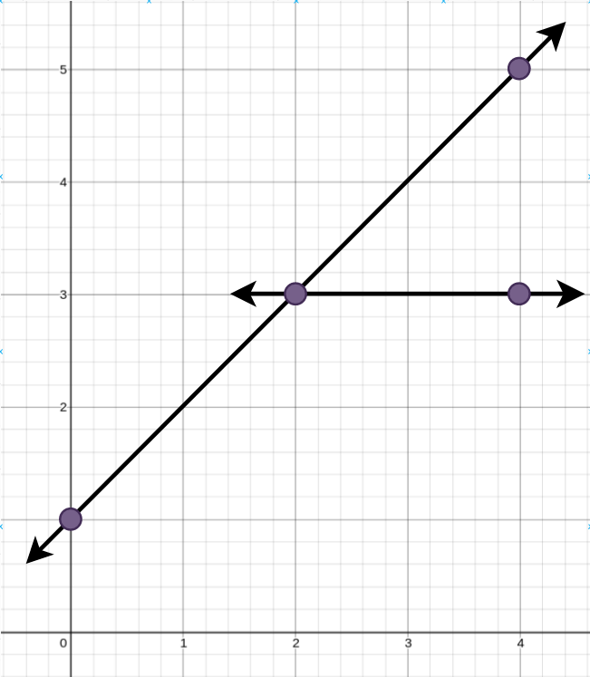
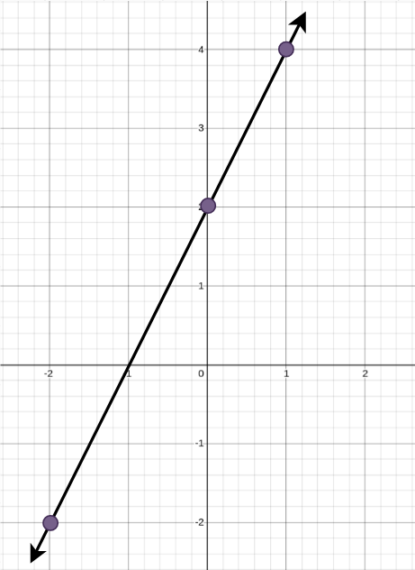

Can you solve this real interview question? Minimum Number of Lines to Cover Points - You are given an array points where points[i] = [xi, yi] represents a point on an X-Y plane.

Straight lines are going to be added to the X-Y plane, such that every point is covered by at least one line.

Return the minimum number of straight lines needed to cover all the points.

 

Example 1:

Input: points = [[0,1],[2,3],[4,5],[4,3]]
Output: 2
Explanation: The minimum number of straight lines needed is two. One possible solution is to add:
- One line connecting the point at (0, 1) to the point at (4, 5).
- Another line connecting the point at (2, 3) to the point at (4, 3).

Example 2:

Input: points = [[0,2],[-2,-2],[1,4]]
Output: 1
Explanation: The minimum number of straight lines needed is one. The only solution is to add:
- One line connecting the point at (-2, -2) to the point at (1, 4).

 

Constraints:

 * 1 <= points.length <= 10
 * points[i].length == 2
 * -100 <= xi, yi <= 100
 * All the points are unique.

---

## Images

- Image 1: `image_1.png`
- Image 2: `image_2.png`
