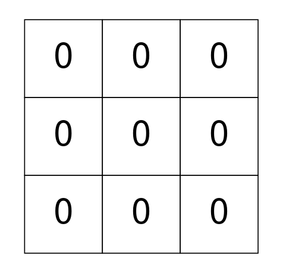
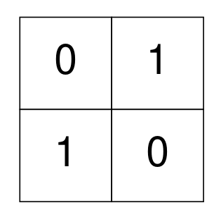

Can you solve this real interview question? Minimum Operations to Remove Adjacent Ones in Matrix - You are given a 0-indexed binary matrix grid. In one operation, you can flip any 1 in grid to be 0.

A binary matrix is well-isolated if there is no 1 in the matrix that is 4-directionally connected (i.e., horizontal and vertical) to another 1.

Return the minimum number of operations to make grid well-isolated.

 

Example 1:

Input: grid = [[1,1,0],[0,1,1],[1,1,1]]
Output: 3
Explanation: Use 3 operations to change grid[0][1], grid[1][2], and grid[2][1] to 0.
After, no more 1's are 4-directionally connected and grid is well-isolated.

Example 2:

Input: grid = [[0,0,0],[0,0,0],[0,0,0]]
Output: 0
Explanation: There are no 1's in grid and it is well-isolated.
No operations were done so return 0.

Example 3:

Input: grid = [[0,1],[1,0]]
Output: 0
Explanation: None of the 1's are 4-directionally connected and grid is well-isolated.
No operations were done so return 0.

 

Constraints:

 * m == grid.length
 * n == grid[i].length
 * 1 <= m, n <= 300
 * grid[i][j] is either 0 or 1.

---

## Images

- Image 1: `image_1.png`
- Image 2: `image_2.png`
- Image 3: `image_3.png`
