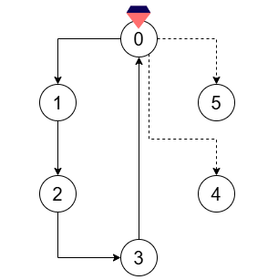
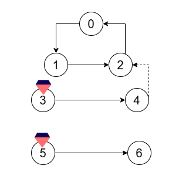

Can you solve this real interview question? Minimum Runes to Add to Cast Spell - Alice has just graduated from wizard school, and wishes to cast a magic spell to celebrate. The magic spell contains certain focus points where magic needs to be concentrated, and some of these focus points contain magic crystals which serve as the spell's energy source. Focus points can be linked through directed runes, which channel magic flow from one focus point to another.

You are given a integer n denoting the number of focus points and an array of integers crystals where crystals[i] indicates a focus point which holds a magic crystal. You are also given two integer arrays flowFrom and flowTo, which represent the existing directed runes. The ith rune allows magic to freely flow from focus point flowFrom[i] to focus point flowTo[i].

You need to find the number of directed runes Alice must add to her spell, such that each focus point either:

 * Contains a magic crystal.
 * Receives magic flow from another focus point.

Return the minimum number of directed runes that she should add.

 

Example 1:

Input: n = 6, crystals = [0], flowFrom = [0,1,2,3], flowTo = [1,2,3,0]

Output: 2

Explanation: 

Add two directed runes:

 * From focus point 0 to focus point 4.
 * From focus point 0 to focus point 5.

Example 2:

Input: n = 7, crystals = [3,5], flowFrom = [0,1,2,3,5], flowTo = [1,2,0,4,6]

Output: 1

Explanation: 

Add a directed rune from focus point 4 to focus point 2.

 

Constraints:

 * 2 <= n <= 105
 * 1 <= crystals.length <= n
 * 0 <= crystals[i] <= n - 1
 * 1 <= flowFrom.length == flowTo.length <= min(2 * 105, (n * (n - 1)) / 2)
 * 0 <= flowFrom[i], flowTo[i] <= n - 1
 * flowFrom[i] != flowTo[i]
 * All pre-existing directed runes are distinct.

---

## Images

- Image 1: `image_1.png`
- Image 2: `image_2.png`
