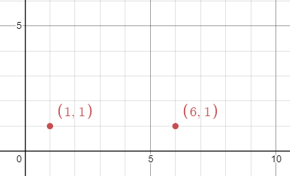

Can you solve this real interview question? Minimum Time For K Virus Variants to Spread - There are n unique virus variants in an infinite 2D grid. You are given a 2D array points, where points[i] = [xi, yi] represents a virus originating at (xi, yi) on day 0. Note that it is possible for multiple virus variants to originate at the same point.

Every day, each cell infected with a virus variant will spread the virus to all neighboring points in the four cardinal directions (i.e. up, down, left, and right). If a cell has multiple variants, all the variants will spread without interfering with each other.

Given an integer k, return the minimum integer number of days for any point to contain at least k of the unique virus variants.

 

Example 1:

Input: points = [[1,1],[6,1]], k = 2
Output: 3
Explanation: On day 3, points (3,1) and (4,1) will contain both virus variants. Note that these are not the only points that will contain both virus variants.

Example 2:

Input: points = [[3,3],[1,2],[9,2]], k = 2
Output: 2
Explanation: On day 2, points (1,3), (2,3), (2,2), and (3,2) will contain the first two viruses. Note that these are not the only points that will contain both virus variants.

Example 3:

Input: points = [[3,3],[1,2],[9,2]], k = 3
Output: 4
Explanation: On day 4, the point (5,2) will contain all 3 viruses. Note that this is not the only point that will contain all 3 virus variants.

 

Constraints:

 * n == points.length
 * 2 <= n <= 50
 * points[i].length == 2
 * 1 <= xi, yi <= 100
 * 2 <= k <= n

---

## Images

- Image 1: `image_1.png`
- Image 2: `image_2.png`
- Image 3: `image_3.png`
