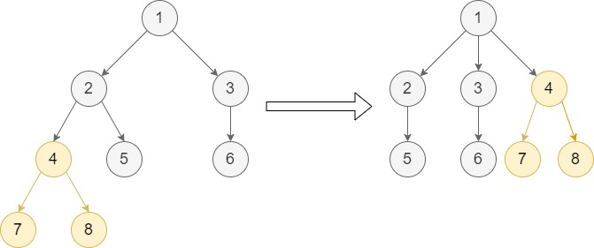
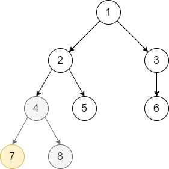
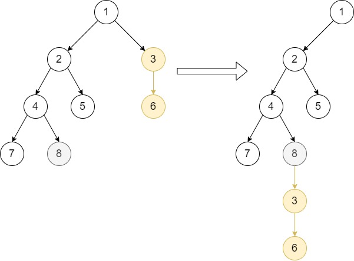

Can you solve this real interview question? Move Sub-Tree of N-Ary Tree - Given the root of an N-ary tree of unique values, and two nodes of the tree p and q.

You should move the subtree of the node p to become a direct child of node q. If p is already a direct child of q, do not change anything. Node p must be the last child in the children list of node q.

Return the root of the tree after adjusting it.

 

There are 3 cases for nodes p and q:

 1. Node q is in the sub-tree of node p.
 2. Node p is in the sub-tree of node q.
 3. Neither node p is in the sub-tree of node q nor node q is in the sub-tree of node p.

In cases 2 and 3, you just need to move p (with its sub-tree) to be a child of q, but in case 1 the tree may be disconnected, thus you need to reconnect the tree again. Please read the examples carefully before solving this problem.

 

Nary-Tree input serialization is represented in their level order traversal, each group of children is separated by the null value (See examples).

For example, the above tree is serialized as [1,null,2,3,4,5,null,null,6,7,null,8,null,9,10,null,null,11,null,12,null,13,null,null,14].

 

Example 1:

Input: root = [1,null,2,3,null,4,5,null,6,null,7,8], p = 4, q = 1
Output: [1,null,2,3,4,null,5,null,6,null,7,8]
Explanation: This example follows the second case as node p is in the sub-tree of node q. We move node p with its sub-tree to be a direct child of node q.
Notice that node 4 is the last child of node 1.

Example 2:

Input: root = [1,null,2,3,null,4,5,null,6,null,7,8], p = 7, q = 4
Output: [1,null,2,3,null,4,5,null,6,null,7,8]
Explanation: Node 7 is already a direct child of node 4. We don't change anything.

Example 3:

Input: root = [1,null,2,3,null,4,5,null,6,null,7,8], p = 3, q = 8
Output: [1,null,2,null,4,5,null,7,8,null,null,null,3,null,6]
Explanation: This example follows case 3 because node p is not in the sub-tree of node q and vice-versa. We can move node 3 with its sub-tree and make it as node 8's child.

 

Constraints:

 * The total number of nodes is between [2, 1000].
 * Each node has a unique value.
 * p != null
 * q != null
 * p and q are two different nodes (i.e. p != q).

---

## Images

- Image 1: `image_1.png`
- Image 2: `image_2.png`
- Image 3: `image_3.png`
- Image 4: `image_4.png`
