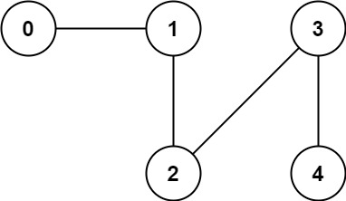

Can you solve this real interview question? Number of Connected Components in an Undirected Graph - You have a graph of n nodes. You are given an integer n and an array edges where edges[i] = [ai, bi] indicates that there is an edge between ai and bi in the graph.

Return the number of connected components in the graph.

 

Example 1:

Input: n = 5, edges = [[0,1],[1,2],[3,4]]
Output: 2

Example 2:

Input: n = 5, edges = [[0,1],[1,2],[2,3],[3,4]]
Output: 1

 

Constraints:

 * 1 <= n <= 2000
 * 1 <= edges.length <= 5000
 * edges[i].length == 2
 * 0 <= ai <= bi < n
 * ai != bi
 * There are no repeated edges.

---

## Images

- Image 1: `image_1.png`
- Image 2: `image_2.png`
