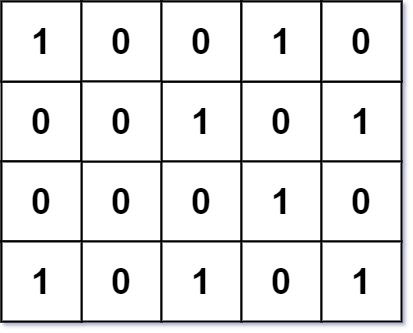
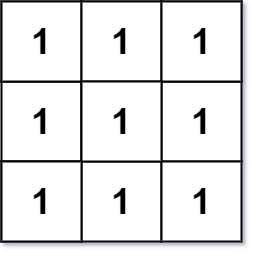

Can you solve this real interview question? Number Of Corner Rectangles - Given an m x n integer matrix grid where each entry is only 0 or 1, return the number of corner rectangles.

A corner rectangle is four distinct 1's on the grid that forms an axis-aligned rectangle. Note that only the corners need to have the value 1. Also, all four 1's used must be distinct.

 

Example 1:

Input: grid = [[1,0,0,1,0],[0,0,1,0,1],[0,0,0,1,0],[1,0,1,0,1]]
Output: 1
Explanation: There is only one corner rectangle, with corners grid[1][2], grid[1][4], grid[3][2], grid[3][4].

Example 2:

Input: grid = [[1,1,1],[1,1,1],[1,1,1]]
Output: 9
Explanation: There are four 2x2 rectangles, four 2x3 and 3x2 rectangles, and one 3x3 rectangle.

Example 3:

Input: grid = [[1,1,1,1]]
Output: 0
Explanation: Rectangles must have four distinct corners.

 

Constraints:

 * m == grid.length
 * n == grid[i].length
 * 1 <= m, n <= 200
 * grid[i][j] is either 0 or 1.
 * The number of 1's in the grid is in the range [1, 6000].

---

## Images

- Image 1: `image_1.png`
- Image 2: `image_2.png`
- Image 3: `image_3.png`
