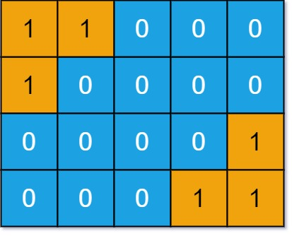
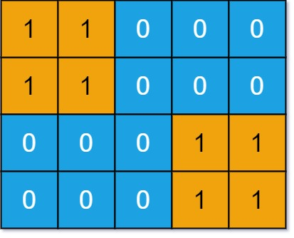

Can you solve this real interview question? Number of Distinct Islands II - You are given an m x n binary matrix grid. An island is a group of 1's (representing land) connected 4-directionally (horizontal or vertical.) You may assume all four edges of the grid are surrounded by water.

An island is considered to be the same as another if they have the same shape, or have the same shape after rotation (90, 180, or 270 degrees only) or reflection (left/right direction or up/down direction).

Return the number of distinct islands.

 

Example 1:

Input: grid = [[1,1,0,0,0],[1,0,0,0,0],[0,0,0,0,1],[0,0,0,1,1]]
Output: 1
Explanation: The two islands are considered the same because if we make a 180 degrees clockwise rotation on the first island, then two islands will have the same shapes.

Example 2:

Input: grid = [[1,1,0,0,0],[1,1,0,0,0],[0,0,0,1,1],[0,0,0,1,1]]
Output: 1

 

Constraints:

 * m == grid.length
 * n == grid[i].length
 * 1 <= m, n <= 50
 * grid[i][j] is either 0 or 1.

---

## Images

- Image 1: `image_1.png`
- Image 2: `image_2.png`
