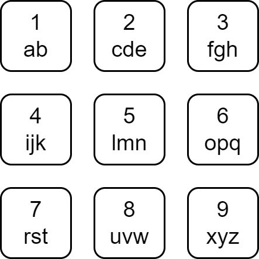

Can you solve this real interview question? Number of Divisible Substrings - Each character of the English alphabet has been mapped to a digit as shown below.

A string is divisible if the sum of the mapped values of its characters is divisible by its length.

Given a string s, return the number of divisible substrings of s.

A substring is a contiguous non-empty sequence of characters within a string.

 

Example 1:

Substring Mapped Sum Length Divisible? a 1 1 1 Yes s 7 7 1 Yes d 2 2 1 Yes f 3 3 1 Yes as 1, 7 8 2 Yes sd 7, 2 9 2 No df 2, 3 5 2 No asd 1, 7, 2 10 3 No sdf 7, 2, 3 12 3 Yes asdf 1, 7, 2, 3 13 4 No

Input: word = "asdf"
Output: 6
Explanation: The table above contains the details about every substring of word, and we can see that 6 of them are divisible.

Example 2:

Input: word = "bdh"
Output: 4
Explanation: The 4 divisible substrings are: "b", "d", "h", "bdh".
It can be shown that there are no other substrings of word that are divisible.

Example 3:

Input: word = "abcd"
Output: 6
Explanation: The 6 divisible substrings are: "a", "b", "c", "d", "ab", "cd".
It can be shown that there are no other substrings of word that are divisible.

 

Constraints:

 * 1 <= word.length <= 2000
 * word consists only of lowercase English letters.

---

## Images

- Image 1: `image_1.png`
