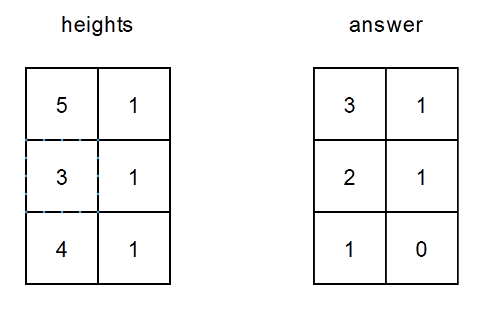

Can you solve this real interview question? Number of People That Can Be Seen in a Grid - You are given an m x n 0-indexed 2D array of positive integers heights where heights[i][j] is the height of the person standing at position (i, j).

A person standing at position (row1, col1) can see a person standing at position (row2, col2) if:

 * The person at (row2, col2) is to the right or below the person at (row1, col1). More formally, this means that either row1 == row2 and col1 < col2 or row1 < row2 and col1 == col2.
 * Everyone in between them is shorter than both of them.

Return an m x n 2D array of integers answer where answer[i][j] is the number of people that the person at position (i, j) can see.

 

Example 1:

Input: heights = [[3,1,4,2,5]]
Output: [[2,1,2,1,0]]
Explanation:
- The person at (0, 0) can see the people at (0, 1) and (0, 2).
  Note that he cannot see the person at (0, 4) because the person at (0, 2) is taller than him.
- The person at (0, 1) can see the person at (0, 2).
- The person at (0, 2) can see the people at (0, 3) and (0, 4).
- The person at (0, 3) can see the person at (0, 4).
- The person at (0, 4) cannot see anybody.

Example 2:

Input: heights = [[5,1],[3,1],[4,1]]
Output: [[3,1],[2,1],[1,0]]
Explanation:
- The person at (0, 0) can see the people at (0, 1), (1, 0) and (2, 0).
- The person at (0, 1) can see the person at (1, 1).
- The person at (1, 0) can see the people at (1, 1) and (2, 0).
- The person at (1, 1) can see the person at (2, 1).
- The person at (2, 0) can see the person at (2, 1).
- The person at (2, 1) cannot see anybody.

 

Constraints:

 * 1 <= heights.length <= 400
 * 1 <= heights[i].length <= 400
 * 1 <= heights[i][j] <= 105

---

## Images

- Image 1: `image_1.png`
- Image 2: `image_2.png`
