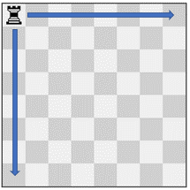
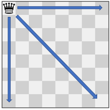
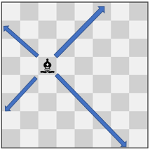

Can you solve this real interview question? Number of Valid Move Combinations On Chessboard - There is an 8 x 8 chessboard containing n pieces (rooks, queens, or bishops). You are given a string array pieces of length n, where pieces[i] describes the type (rook, queen, or bishop) of the ith piece. In addition, you are given a 2D integer array positions also of length n, where positions[i] = [ri, ci] indicates that the ith piece is currently at the 1-based coordinate (ri, ci) on the chessboard.

When making a move for a piece, you choose a destination square that the piece will travel toward and stop on.

 * A rook can only travel horizontally or vertically from (r, c) to the direction of (r+1, c), (r-1, c), (r, c+1), or (r, c-1).
 * A queen can only travel horizontally, vertically, or diagonally from (r, c) to the direction of (r+1, c), (r-1, c), (r, c+1), (r, c-1), (r+1, c+1), (r+1, c-1), (r-1, c+1), (r-1, c-1).
 * A bishop can only travel diagonally from (r, c) to the direction of (r+1, c+1), (r+1, c-1), (r-1, c+1), (r-1, c-1).

You must make a move for every piece on the board simultaneously. A move combination consists of all the moves performed on all the given pieces. Every second, each piece will instantaneously travel one square towards their destination if they are not already at it. All pieces start traveling at the 0th second. A move combination is invalid if, at a given time, two or more pieces occupy the same square.

Return the number of valid move combinations .

Notes:

 * No two pieces will start in the same square.
 * You may choose the square a piece is already on as its destination.
 * If two pieces are directly adjacent to each other, it is valid for them to move past each other and swap positions in one second.

 

Example 1:

Input: pieces = ["rook"], positions = [[1,1]]
Output: 15
Explanation: The image above shows the possible squares the piece can move to.

Example 2:

Input: pieces = ["queen"], positions = [[1,1]]
Output: 22
Explanation: The image above shows the possible squares the piece can move to.

Example 3:

Input: pieces = ["bishop"], positions = [[4,3]]
Output: 12
Explanation: The image above shows the possible squares the piece can move to.

 

Constraints:

 * n == pieces.length
 * n == positions.length
 * 1 <= n <= 4
 * pieces only contains the strings "rook", "queen", and "bishop".
 * There will be at most one queen on the chessboard.
 * 1 <= ri, ci <= 8
 * Each positions[i] is distinct.

---

## Images

- Image 1: `image_1.png`
- Image 2: `image_2.png`
- Image 3: `image_3.png`
