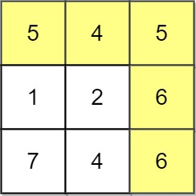
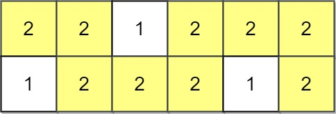

Can you solve this real interview question? Path With Maximum Minimum Value - Given an m x n integer matrix grid, return the maximum score of a path starting at (0, 0) and ending at (m - 1, n - 1) moving in the 4 cardinal directions.

The score of a path is the minimum value in that path.

 * For example, the score of the path 8 → 4 → 5 → 9 is 4.

 

Example 1:

Input: grid = [[5,4,5],[1,2,6],[7,4,6]]
Output: 4
Explanation: The path with the maximum score is highlighted in yellow. 

Example 2:

Input: grid = [[2,2,1,2,2,2],[1,2,2,2,1,2]]
Output: 2

Example 3:

Input: grid = [[3,4,6,3,4],[0,2,1,1,7],[8,8,3,2,7],[3,2,4,9,8],[4,1,2,0,0],[4,6,5,4,3]]
Output: 3

 

Constraints:

 * m == grid.length
 * n == grid[i].length
 * 1 <= m, n <= 100
 * 0 <= grid[i][j] <= 109

---

## Images

- Image 1: `image_1.png`
- Image 2: `image_2.png`
- Image 3: `image_3.png`
