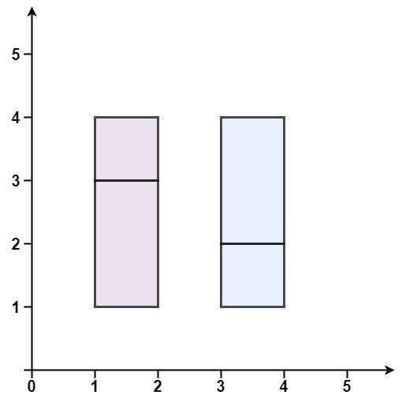

Can you solve this real interview question? Perfect Rectangle - Given an array rectangles where rectangles[i] = [xi, yi, ai, bi] represents an axis-aligned rectangle. The bottom-left point of the rectangle is (xi, yi) and the top-right point of it is (ai, bi).

Return true if all the rectangles together form an exact cover of a rectangular region.

 

Example 1:

Input: rectangles = [[1,1,3,3],[3,1,4,2],[3,2,4,4],[1,3,2,4],[2,3,3,4]]
Output: true
Explanation: All 5 rectangles together form an exact cover of a rectangular region.

Example 2:

Input: rectangles = [[1,1,2,3],[1,3,2,4],[3,1,4,2],[3,2,4,4]]
Output: false
Explanation: Because there is a gap between the two rectangular regions.

Example 3:

Input: rectangles = [[1,1,3,3],[3,1,4,2],[1,3,2,4],[2,2,4,4]]
Output: false
Explanation: Because two of the rectangles overlap with each other.

 

Constraints:

 * 1 <= rectangles.length <= 2 * 104
 * rectangles[i].length == 4
 * -105 <= xi < ai <= 105
 * -105 <= yi < bi <= 105

---

## Images

- Image 1: `image_1.png`
- Image 2: `image_2.png`
- Image 3: `image_3.png`
