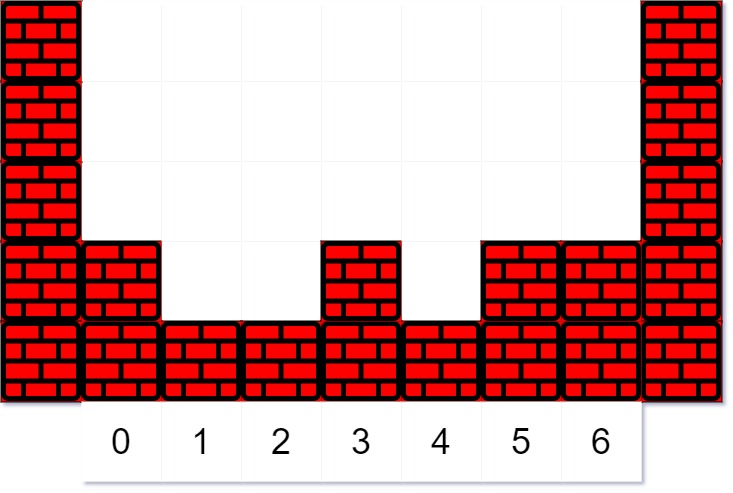
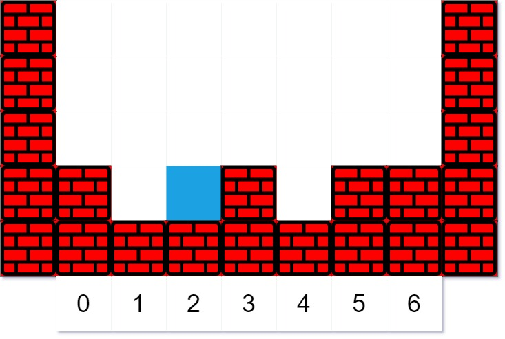

Can you solve this real interview question? Pour Water - You are given an elevation map represents as an integer array heights where heights[i] representing the height of the terrain at index i. The width at each index is 1. You are also given two integers volume and k. volume units of water will fall at index k.

Water first drops at the index k and rests on top of the highest terrain or water at that index. Then, it flows according to the following rules:

 * If the droplet would eventually fall by moving left, then move left.
 * Otherwise, if the droplet would eventually fall by moving right, then move right.
 * Otherwise, rise to its current position.

Here, "eventually fall" means that the droplet will eventually be at a lower level if it moves in that direction. Also, level means the height of the terrain plus any water in that column.

We can assume there is infinitely high terrain on the two sides out of bounds of the array. Also, there could not be partial water being spread out evenly on more than one grid block, and each unit of water has to be in exactly one block.

 

Example 1:

Input: heights = [2,1,1,2,1,2,2], volume = 4, k = 3
Output: [2,2,2,3,2,2,2]
Explanation:
The first drop of water lands at index k = 3. When moving left or right, the water can only move to the same level or a lower level. (By level, we mean the total height of the terrain plus any water in that column.)
Since moving left will eventually make it fall, it moves left. (A droplet "made to fall" means go to a lower height than it was at previously.) Since moving left will not make it fall, it stays in place.

The next droplet falls at index k = 3. Since the new droplet moving left will eventually make it fall, it moves left. Notice that the droplet still preferred to move left, even though it could move right (and moving right makes it fall quicker.)

The third droplet falls at index k = 3. Since moving left would not eventually make it fall, it tries to move right. Since moving right would eventually make it fall, it moves right.

Finally, the fourth droplet falls at index k = 3. Since moving left would not eventually make it fall, it tries to move right. Since moving right would not eventually make it fall, it stays in place.

Example 2:

Input: heights = [1,2,3,4], volume = 2, k = 2
Output: [2,3,3,4]
Explanation: The last droplet settles at index 1, since moving further left would not cause it to eventually fall to a lower height.

Example 3:

Input: heights = [3,1,3], volume = 5, k = 1
Output: [4,4,4]

 

Constraints:

 * 1 <= heights.length <= 100
 * 0 <= heights[i] <= 99
 * 0 <= volume <= 2000
 * 0 <= k < heights.length

---

## Images

- Image 1: `image_1.png`
- Image 2: `image_2.png`
- Image 3: `image_3.png`
- Image 4: `image_4.png`
- Image 5: `image_5.png`
