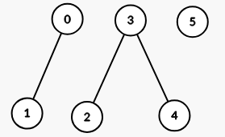

Can you solve this real interview question? Properties Graph - You are given a 2D integer array properties having dimensions n x m and an integer k.

Define a function intersect(a, b) that returns the number of distinct integers common to both arrays a and b.

Construct an undirected graph where each index i corresponds to properties[i]. There is an edge between node i and node j if and only if intersect(properties[i], properties[j]) >= k, where i and j are in the range [0, n - 1] and i != j.

Return the number of connected components in the resulting graph.

 

Example 1:

Input: properties = [[1,2],[1,1],[3,4],[4,5],[5,6],[7,7]], k = 1

Output: 3

Explanation:

The graph formed has 3 connected components:

Example 2:

Input: properties = [[1,2,3],[2,3,4],[4,3,5]], k = 2

Output: 1

Explanation:

The graph formed has 1 connected component:

Example 3:

Input: properties = [[1,1],[1,1]], k = 2

Output: 2

Explanation:

intersect(properties[0], properties[1]) = 1, which is less than k. This means there is no edge between properties[0] and properties[1] in the graph.

 

Constraints:

 * 1 <= n == properties.length <= 100
 * 1 <= m == properties[i].length <= 100
 * 1 <= properties[i][j] <= 100
 * 1 <= k <= m

---

## Images

- Image 1: `image_1.png`
- Image 2: `image_2.png`
