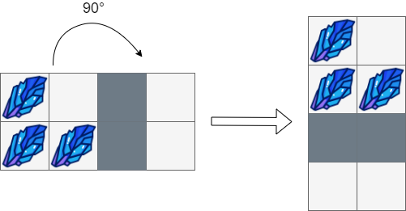
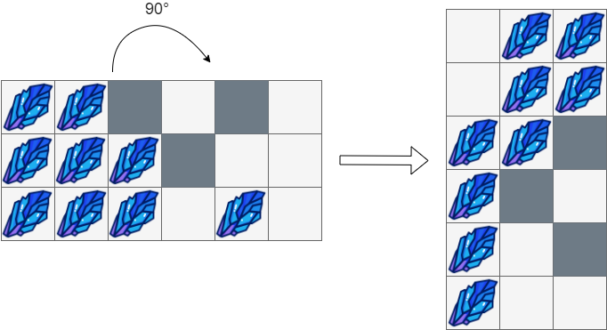

Can you solve this real interview question? Rotating the Box - You are given an m x n matrix of characters boxGrid representing a side-view of a box. Each cell of the box is one of the following:

 * A stone '#'
 * A stationary obstacle '*'
 * Empty '.'

The box is rotated 90 degrees clockwise, causing some of the stones to fall due to gravity. Each stone falls down until it lands on an obstacle, another stone, or the bottom of the box. Gravity does not affect the obstacles' positions, and the inertia from the box's rotation does not affect the stones' horizontal positions.

It is guaranteed that each stone in boxGrid rests on an obstacle, another stone, or the bottom of the box.

Return an n x m matrix representing the box after the rotation described above.

 

Example 1:

Input: boxGrid = [["#",".","#"]]
Output: [["."],
         ["#"],
         ["#"]]

Example 2:

Input: boxGrid = [["#",".","*","."],
              ["#","#","*","."]]
Output: [["#","."],
         ["#","#"],
         ["*","*"],
         [".","."]]

Example 3:

Input: boxGrid = [["#","#","*",".","*","."],
              ["#","#","#","*",".","."],
              ["#","#","#",".","#","."]]
Output: [[".","#","#"],
         [".","#","#"],
         ["#","#","*"],
         ["#","*","."],
         ["#",".","*"],
         ["#",".","."]]

 

Constraints:

 * m == boxGrid.length
 * n == boxGrid[i].length
 * 1 <= m, n <= 500
 * boxGrid[i][j] is either '#', '*', or '.'.

---

## Images

- Image 1: `image_1.png`
- Image 2: `image_2.png`
- Image 3: `image_3.png`
