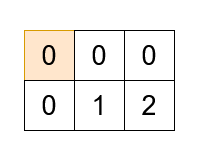

Can you solve this real interview question? Sequential Grid Path Cover - You are given a 2D array grid of size m x n, and an integer k. There are k cells in grid containing the values from 1 to k exactly once, and the rest of the cells have a value 0.

You can start at any cell, and move from a cell to its neighbors (up, down, left, or right). You must find a path in grid which:

 * Visits each cell in grid exactly once.
 * Visits the cells with values from 1 to k in order.

Return a 2D array result of size (m * n) x 2, where result[i] = [xi, yi] represents the ith cell visited in the path. If there are multiple such paths, you may return any one.

If no such path exists, return an empty array.

 

Example 1:

Input: grid = [[0,0,0],[0,1,2]], k = 2

Output: [[0,0],[1,0],[1,1],[1,2],[0,2],[0,1]]

Explanation:

Example 2:

Input: grid = [[1,0,4],[3,0,2]], k = 4

Output: []

Explanation:

There is no possible path that satisfies the conditions.

 

Constraints:

 * 1 <= m == grid.length <= 5
 * 1 <= n == grid[i].length <= 5
 * 1 <= k <= m * n
 * 0 <= grid[i][j] <= k
 * grid contains all integers between 1 and k exactly once.

---

## Images

- Image 1: `image_1.png`
