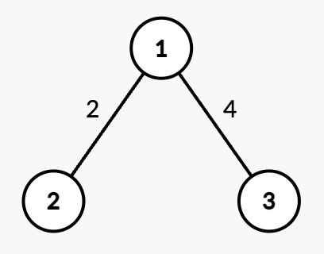

Can you solve this real interview question? Shortest Path in a Weighted Tree - You are given an integer n and an undirected, weighted tree rooted at node 1 with n nodes numbered from 1 to n. This is represented by a 2D array edges of length n - 1, where edges[i] = [ui, vi, wi] indicates an undirected edge from node ui to vi with weight wi.

You are also given a 2D integer array queries of length q, where each queries[i] is either:

 * [1, u, v, w'] – Update the weight of the edge between nodes u and v to w', where (u, v) is guaranteed to be an edge present in edges.
 * [2, x] – Compute the shortest path distance from the root node 1 to node x.

Return an integer array answer, where answer[i] is the shortest path distance from node 1 to x for the ith query of [2, x].

 

Example 1:

Input: n = 2, edges = [[1,2,7]], queries = [[2,2],[1,1,2,4],[2,2]]

Output: [7,4]

Explanation:

 * Query [2,2]: The shortest path from root node 1 to node 2 is 7.
 * Query [1,1,2,4]: The weight of edge (1,2) changes from 7 to 4.
 * Query [2,2]: The shortest path from root node 1 to node 2 is 4.

Example 2:

Input: n = 3, edges = [[1,2,2],[1,3,4]], queries = [[2,1],[2,3],[1,1,3,7],[2,2],[2,3]]

Output: [0,4,2,7]

Explanation:

 * Query [2,1]: The shortest path from root node 1 to node 1 is 0.
 * Query [2,3]: The shortest path from root node 1 to node 3 is 4.
 * Query [1,1,3,7]: The weight of edge (1,3) changes from 4 to 7.
 * Query [2,2]: The shortest path from root node 1 to node 2 is 2.
 * Query [2,3]: The shortest path from root node 1 to node 3 is 7.

Example 3:

Input: n = 4, edges = [[1,2,2],[2,3,1],[3,4,5]], queries = [[2,4],[2,3],[1,2,3,3],[2,2],[2,3]]

Output: [8,3,2,5]

Explanation:

 * Query [2,4]: The shortest path from root node 1 to node 4 consists of edges (1,2), (2,3), and (3,4) with weights 2 + 1 + 5 = 8.
 * Query [2,3]: The shortest path from root node 1 to node 3 consists of edges (1,2) and (2,3) with weights 2 + 1 = 3.
 * Query [1,2,3,3]: The weight of edge (2,3) changes from 1 to 3.
 * Query [2,2]: The shortest path from root node 1 to node 2 is 2.
 * Query [2,3]: The shortest path from root node 1 to node 3 consists of edges (1,2) and (2,3) with updated weights 2 + 3 = 5.

 

Constraints:

 * 1 <= n <= 105
 * edges.length == n - 1
 * edges[i] == [ui, vi, wi]
 * 1 <= ui, vi <= n
 * 1 <= wi <= 104
 * The input is generated such that edges represents a valid tree.
 * 1 <= queries.length == q <= 105
 * queries[i].length == 2 or 4
   * queries[i] == [1, u, v, w'] or,
   * queries[i] == [2, x]
   * 1 <= u, v, x <= n
   * (u, v) is always an edge from edges.
   * 1 <= w' <= 104

---

## Images

- Image 1: `image_1.png`
- Image 2: `image_2.png`
- Image 3: `image_3.png`
