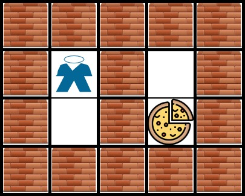

Can you solve this real interview question? Shortest Path to Get Food - You are starving and you want to eat food as quickly as possible. You want to find the shortest path to arrive at any food cell.

You are given an m x n character matrix, grid, of these different types of cells:

 * '*' is your location. There is exactly one '*' cell.
 * '#' is a food cell. There may be multiple food cells.
 * 'O' is free space, and you can travel through these cells.
 * 'X' is an obstacle, and you cannot travel through these cells.

You can travel to any adjacent cell north, east, south, or west of your current location if there is not an obstacle.

Return the length of the shortest path for you to reach any food cell. If there is no path for you to reach food, return -1.

 

Example 1:

Input: grid = [["X","X","X","X","X","X"],["X","*","O","O","O","X"],["X","O","O","#","O","X"],["X","X","X","X","X","X"]]
Output: 3
Explanation: It takes 3 steps to reach the food.

Example 2:

Input: grid = [["X","X","X","X","X"],["X","*","X","O","X"],["X","O","X","#","X"],["X","X","X","X","X"]]
Output: -1
Explanation: It is not possible to reach the food.

Example 3:

Input: grid = [["X","X","X","X","X","X","X","X"],["X","*","O","X","O","#","O","X"],["X","O","O","X","O","O","X","X"],["X","O","O","O","O","#","O","X"],["X","X","X","X","X","X","X","X"]]
Output: 6
Explanation: There can be multiple food cells. It only takes 6 steps to reach the bottom food.

Example 4:

Input: grid = [["X","X","X","X","X","X","X","X"],["X","*","O","X","O","#","O","X"],["X","O","O","X","O","O","X","X"],["X","O","O","O","O","#","O","X"],["O","O","O","O","O","O","O","O"]]
Output: 5

 

Constraints:

 * m == grid.length
 * n == grid[i].length
 * 1 <= m, n <= 200
 * grid[row][col] is '*', 'X', 'O', or '#'.
 * The grid contains exactly one '*'.

---

## Images

- Image 1: `image_1.png`
- Image 2: `image_2.png`
- Image 3: `image_3.png`
