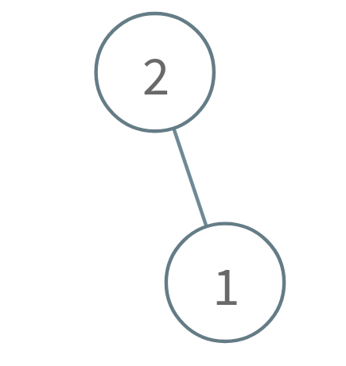

Can you solve this real interview question? Subtree Removal Game with Fibonacci Tree - A Fibonacci tree is a binary tree created using the order function order(n):

 * order(0) is the empty tree.
 * order(1) is a binary tree with only one node.
 * order(n) is a binary tree that consists of a root node with the left subtree as order(n - 2) and the right subtree as order(n - 1).

Alice and Bob are playing a game with a Fibonacci tree with Alice staring first. On each turn, a player selects a node and removes that node and its subtree. The player that is forced to delete root loses.

Given the integer n, return true if Alice wins the game or false if Bob wins, assuming both players play optimally.

A subtree of a binary tree tree is a tree that consists of a node in tree and all of this node's descendants. The tree tree could also be considered as a subtree of itself.

 

Example 1:

Input: n = 3
Output: true
Explanation:
Alice takes the node 1 in the right subtree.
Bob takes either the 1 in the left subtree or the 2 in the right subtree.
Alice takes whichever node Bob doesn't take.
Bob is forced to take the root node 3, so Bob will lose.
Return true because Alice wins.

Example 2:

Input: n = 1
Output: false
Explanation:
Alice is forced to take the root node 1, so Alice will lose.
Return false because Alice loses.

Example 3:

Input: n = 2
Output: true
Explanation:
Alice takes the node 1.
Bob is forced to take the root node 2, so Bob will lose.
Return true because Alice wins.

 

Constraints:

 * 1 <= n <= 100

---

## Images

- Image 1: `image_1.png`
- Image 2: `image_2.png`
- Image 3: `image_3.png`
