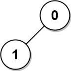

Can you solve this real interview question? Sum of Distances in Tree - There is an undirected connected tree with n nodes labeled from 0 to n - 1 and n - 1 edges.

You are given the integer n and the array edges where edges[i] = [ai, bi] indicates that there is an edge between nodes ai and bi in the tree.

Return an array answer of length n where answer[i] is the sum of the distances between the ith node in the tree and all other nodes.

 

Example 1:

Input: n = 6, edges = [[0,1],[0,2],[2,3],[2,4],[2,5]]
Output: [8,12,6,10,10,10]
Explanation: The tree is shown above.
We can see that dist(0,1) + dist(0,2) + dist(0,3) + dist(0,4) + dist(0,5)
equals 1 + 1 + 2 + 2 + 2 = 8.
Hence, answer[0] = 8, and so on.

Example 2:

Input: n = 1, edges = []
Output: [0]

Example 3:

Input: n = 2, edges = [[1,0]]
Output: [1,1]

 

Constraints:

 * 1 <= n <= 3 * 104
 * edges.length == n - 1
 * edges[i].length == 2
 * 0 <= ai, bi < n
 * ai != bi
 * The given input represents a valid tree.

---

## Images

- Image 1: `image_1.png`
- Image 2: `image_2.png`
- Image 3: `image_3.png`
