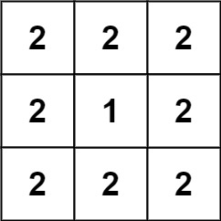

Can you solve this real interview question? Surface Area of 3D Shapes - You are given an n x n grid where you have placed some 1 x 1 x 1 cubes. Each value v = grid[i][j] represents a tower of v cubes placed on top of cell (i, j).

After placing these cubes, you have decided to glue any directly adjacent cubes to each other, forming several irregular 3D shapes.

Return the total surface area of the resulting shapes.

Note: The bottom face of each shape counts toward its surface area.

 

Example 1:

Input: grid = [[1,2],[3,4]]
Output: 34

Example 2:

Input: grid = [[1,1,1],[1,0,1],[1,1,1]]
Output: 32

Example 3:

Input: grid = [[2,2,2],[2,1,2],[2,2,2]]
Output: 46

 

Constraints:

 * n == grid.length == grid[i].length
 * 1 <= n <= 50
 * 0 <= grid[i][j] <= 50

---

## Images

- Image 1: `image_1.png`
- Image 2: `image_2.png`
- Image 3: `image_3.png`
