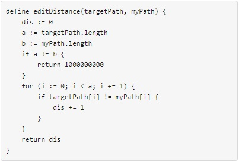
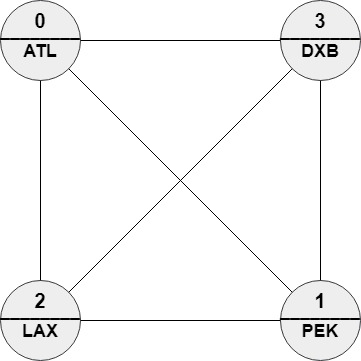

Can you solve this real interview question? The Most Similar Path in a Graph - We have n cities and m bi-directional roads where roads[i] = [ai, bi] connects city ai with city bi. Each city has a name consisting of exactly three upper-case English letters given in the string array names. Starting at any city x, you can reach any city y where y != x (i.e., the cities and the roads are forming an undirected connected graph).

You will be given a string array targetPath. You should find a path in the graph of the same length and with the minimum edit distance to targetPath.

You need to return the order of the nodes in the path with the minimum edit distance. The path should be of the same length of targetPath and should be valid (i.e., there should be a direct road between ans[i] and ans[i + 1]). If there are multiple answers return any one of them.

The edit distance is defined as follows:

 

Example 1:

Input: n = 5, roads = [[0,2],[0,3],[1,2],[1,3],[1,4],[2,4]], names = ["ATL","PEK","LAX","DXB","HND"], targetPath = ["ATL","DXB","HND","LAX"]
Output: [0,2,4,2]
Explanation: [0,2,4,2], [0,3,0,2] and [0,3,1,2] are accepted answers.
[0,2,4,2] is equivalent to ["ATL","LAX","HND","LAX"] which has edit distance = 1 with targetPath.
[0,3,0,2] is equivalent to ["ATL","DXB","ATL","LAX"] which has edit distance = 1 with targetPath.
[0,3,1,2] is equivalent to ["ATL","DXB","PEK","LAX"] which has edit distance = 1 with targetPath.

Example 2:

Input: n = 4, roads = [[1,0],[2,0],[3,0],[2,1],[3,1],[3,2]], names = ["ATL","PEK","LAX","DXB"], targetPath = ["ABC","DEF","GHI","JKL","MNO","PQR","STU","VWX"]
Output: [0,1,0,1,0,1,0,1]
Explanation: Any path in this graph has edit distance = 8 with targetPath.

Example 3:

Input: n = 6, roads = [[0,1],[1,2],[2,3],[3,4],[4,5]], names = ["ATL","PEK","LAX","ATL","DXB","HND"], targetPath = ["ATL","DXB","HND","DXB","ATL","LAX","PEK"]
Output: [3,4,5,4,3,2,1]
Explanation: [3,4,5,4,3,2,1] is the only path with edit distance = 0 with targetPath.
It's equivalent to ["ATL","DXB","HND","DXB","ATL","LAX","PEK"]

 

Constraints:

 * 2 <= n <= 100
 * m == roads.length
 * n - 1 <= m <= (n * (n - 1) / 2)
 * 0 <= ai, bi <= n - 1
 * ai != bi
 * The graph is guaranteed to be connected and each pair of nodes may have at most one direct road.
 * names.length == n
 * names[i].length == 3
 * names[i] consists of upper-case English letters.
 * There can be two cities with the same name.
 * 1 <= targetPath.length <= 100
 * targetPath[i].length == 3
 * targetPath[i] consists of upper-case English letters.

 

Follow up: If each node can be visited only once in the path, What should you change in your solution?

---

## Images

- Image 1: `image_1.png`
- Image 2: `image_2.png`
- Image 3: `image_3.png`
- Image 4: `image_4.png`
