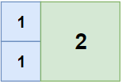
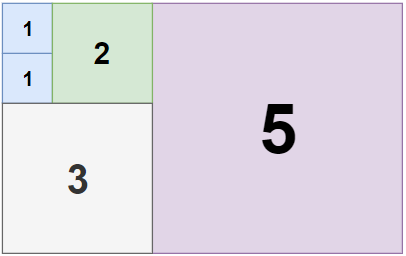

Can you solve this real interview question? Tiling a Rectangle with the Fewest Squares - Given a rectangle of size n x m, return the minimum number of integer-sided squares that tile the rectangle.

 

Example 1:

Input: n = 2, m = 3
Output: 3
Explanation: 3 squares are necessary to cover the rectangle.
2 (squares of 1x1)
1 (square of 2x2)

Example 2:

Input: n = 5, m = 8
Output: 5

Example 3:

Input: n = 11, m = 13
Output: 6

 

Constraints:

 * 1 <= n, m <= 13

---

## Images

- Image 1: `image_1.png`
- Image 2: `image_2.png`
- Image 3: `image_3.png`
