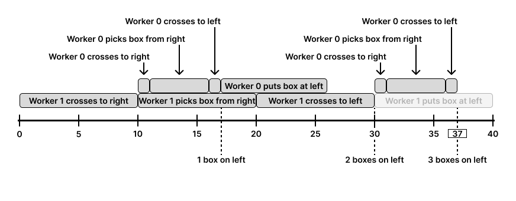

Can you solve this real interview question? Time to Cross a Bridge - There are k workers who want to move n boxes from the right (old) warehouse to the left (new) warehouse. You are given the two integers n and k, and a 2D integer array time of size k x 4 where time[i] = [righti, picki, lefti, puti].

The warehouses are separated by a river and connected by a bridge. Initially, all k workers are waiting on the left side of the bridge. To move the boxes, the ith worker can do the following:

 * Cross the bridge to the right side in righti minutes.
 * Pick a box from the right warehouse in picki minutes.
 * Cross the bridge to the left side in lefti minutes.
 * Put the box into the left warehouse in puti minutes.

The ith worker is less efficient than the jth worker if either condition is met:

 * lefti + righti > leftj + rightj
 * lefti + righti == leftj + rightj and i > j

The following rules regulate the movement of the workers through the bridge:

 * Only one worker can use the bridge at a time.
 * When the bridge is unused prioritize the least efficient worker (who have picked up the box) on the right side to cross. If not, prioritize the least efficient worker on the left side to cross.
 * If enough workers have already been dispatched from the left side to pick up all the remaining boxes, no more workers will be sent from the left side.

Return the elapsed minutes at which the last box reaches the left side of the bridge.

 

Example 1:

Input: n = 1, k = 3, time = [[1,1,2,1],[1,1,3,1],[1,1,4,1]]

Output: 6

Explanation:

From 0 to 1 minutes: worker 2 crosses the bridge to the right.
From 1 to 2 minutes: worker 2 picks up a box from the right warehouse.
From 2 to 6 minutes: worker 2 crosses the bridge to the left.
From 6 to 7 minutes: worker 2 puts a box at the left warehouse.
The whole process ends after 7 minutes. We return 6 because the problem asks for the instance of time at which the last worker reaches the left side of the bridge.

Example 2:

Input: n = 3, k = 2, time = [[1,5,1,8],[10,10,10,10]]

Output: 37

Explanation:

The last box reaches the left side at 37 seconds. Notice, how we do not put the last boxes down, as that would take more time, and they are already on the left with the workers.

 

Constraints:

 * 1 <= n, k <= 104
 * time.length == k
 * time[i].length == 4
 * 1 <= lefti, picki, righti, puti <= 1000

---

## Images

- Image 1: `image_1.png`
