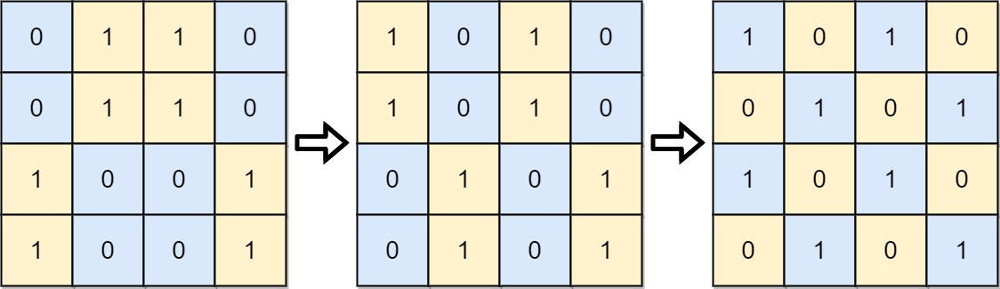
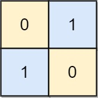
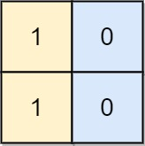

Can you solve this real interview question? Transform to Chessboard - You are given an n x n binary grid board. In each move, you can swap any two rows with each other, or any two columns with each other.

Return the minimum number of moves to transform the board into a chessboard board. If the task is impossible, return -1.

A chessboard board is a board where no 0's and no 1's are 4-directionally adjacent.

 

Example 1:

Input: board = [[0,1,1,0],[0,1,1,0],[1,0,0,1],[1,0,0,1]]
Output: 2
Explanation: One potential sequence of moves is shown.
The first move swaps the first and second column.
The second move swaps the second and third row.

Example 2:

Input: board = [[0,1],[1,0]]
Output: 0
Explanation: Also note that the board with 0 in the top left corner, is also a valid chessboard.

Example 3:

Input: board = [[1,0],[1,0]]
Output: -1
Explanation: No matter what sequence of moves you make, you cannot end with a valid chessboard.

 

Constraints:

 * n == board.length
 * n == board[i].length
 * 2 <= n <= 30
 * board[i][j] is either 0 or 1.

---

## Images

- Image 1: `image_1.png`
- Image 2: `image_2.png`
- Image 3: `image_3.png`
