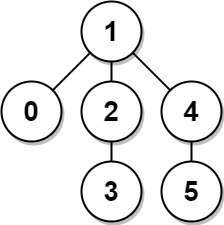

Can you solve this real interview question? Tree Diameter - The diameter of a tree is the number of edges in the longest path in that tree.

There is an undirected tree of n nodes labeled from 0 to n - 1. You are given a 2D array edges where edges.length == n - 1 and edges[i] = [ai, bi] indicates that there is an undirected edge between nodes ai and bi in the tree.

Return the diameter of the tree.

 

Example 1:

Input: edges = [[0,1],[0,2]]
Output: 2
Explanation: The longest path of the tree is the path 1 - 0 - 2.

Example 2:

Input: edges = [[0,1],[1,2],[2,3],[1,4],[4,5]]
Output: 4
Explanation: The longest path of the tree is the path 3 - 2 - 1 - 4 - 5.

 

Constraints:

 * n == edges.length + 1
 * 1 <= n <= 104
 * 0 <= ai, bi < n
 * ai != bi

---

## Images

- Image 1: `image_1.png`
- Image 2: `image_2.png`
