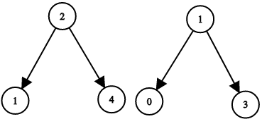
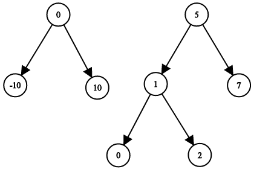

Can you solve this real interview question? Two Sum BSTs - Given the roots of two binary search trees, root1 and root2, return true if and only if there is a node in the first tree and a node in the second tree whose values sum up to a given integer target.

 

Example 1:

Input: root1 = [2,1,4], root2 = [1,0,3], target = 5
Output: true
Explanation: 2 and 3 sum up to 5.

Example 2:

Input: root1 = [0,-10,10], root2 = [5,1,7,0,2], target = 18
Output: false

 

Constraints:

 * The number of nodes in each tree is in the range [1, 5000].
 * -109 <= Node.val, target <= 109

---

## Images

- Image 1: `image_1.png`
- Image 2: `image_2.png`
