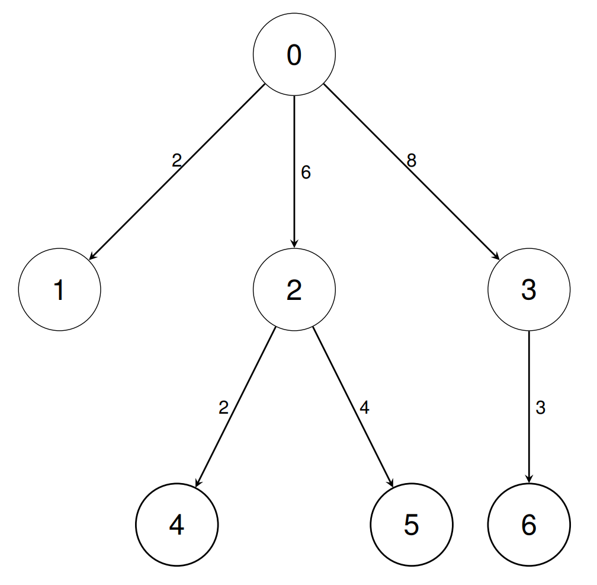

Can you solve this real interview question? Unit Conversion II - There are n types of units indexed from 0 to n - 1.

You are given a 2D integer array conversions of length n - 1, where conversions[i] = [sourceUniti, targetUniti, conversionFactori]. This indicates that a single unit of type sourceUniti is equivalent to conversionFactori units of type targetUniti.

You are also given a 2D integer array queries of length q, where queries[i] = [unitAi, unitBi].

Return an array answer of length q where answer[i] is the number of units of type unitBi equivalent to 1 unit of type unitAi, and can be represented as p/q where p and q are coprime. Return each answer[i] as pq-1 modulo 109 + 7, where q-1 represents the multiplicative inverse of q modulo 109 + 7.

 

Example 1:

Input: conversions = [[0,1,2],[0,2,6]], queries = [[1,2],[1,0]]

Output: [3,500000004]

Explanation:

 * In the first query, we can convert unit 1 into 3 units of type 2 using the inverse of conversions[0], then conversions[1].
 * In the second query, we can convert unit 1 into 1/2 units of type 0 using the inverse of conversions[0]. We return 500000004 since it is the multiplicative inverse of 2.

Example 2:

Input: conversions = [[0,1,2],[0,2,6],[0,3,8],[2,4,2],[2,5,4],[3,6,3]], queries = [[1,2],[0,4],[6,5],[4,6],[6,1]]

Output: [3,12,1,2,83333334]

Explanation:

 * In the first query, we can convert unit 1 into 3 units of type 2 using the inverse of conversions[0], then conversions[1].
 * In the second query, we can convert unit 0 into 12 units of type 4 using conversions[1], then conversions[3].
 * In the third query, we can convert unit 6 into 1 unit of type 5 using the inverse of conversions[5], the inverse of conversions[2], conversions[1], then conversions[4].
 * In the fourth query, we can convert unit 4 into 2 units of type 6 using the inverse of conversions[3], the inverse of conversions[1], conversions[2], then conversions[5].
 * In the fifth query, we can convert unit 6 into 1/12 units of type 1 using the inverse of conversions[5], the inverse of conversions[2], then conversions[0]. We return 83333334 since it is the multiplicative inverse of 12.

 

Constraints:

 * 2 <= n <= 105
 * conversions.length == n - 1
 * 0 <= sourceUniti, targetUniti < n
 * 1 <= conversionFactori <= 109
 * 1 <= q <= 105
 * queries.length == q
 * 0 <= unitAi, unitBi < n
 * It is guaranteed that unit 0 can be uniquely converted into any other unit through a combination of forward or backward conversions.

---

## Images

- Image 1: `image_1.png`
- Image 2: `image_2.png`
