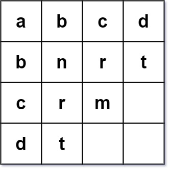

Can you solve this real interview question? Valid Word Square - Given an array of strings words, return true if it forms a valid word square.

A sequence of strings forms a valid word square if the kth row and column read the same string, where 0 <= k < max(numRows, numColumns).

 

Example 1:

Input: words = ["abcd","bnrt","crmy","dtye"]
Output: true
Explanation:
The 1st row and 1st column both read "abcd".
The 2nd row and 2nd column both read "bnrt".
The 3rd row and 3rd column both read "crmy".
The 4th row and 4th column both read "dtye".
Therefore, it is a valid word square.

Example 2:

Input: words = ["abcd","bnrt","crm","dt"]
Output: true
Explanation:
The 1st row and 1st column both read "abcd".
The 2nd row and 2nd column both read "bnrt".
The 3rd row and 3rd column both read "crm".
The 4th row and 4th column both read "dt".
Therefore, it is a valid word square.

Example 3:

Input: words = ["ball","area","read","lady"]
Output: false
Explanation:
The 3rd row reads "read" while the 3rd column reads "lead".
Therefore, it is NOT a valid word square.

 

Constraints:

 * 1 <= words.length <= 500
 * 1 <= words[i].length <= 500
 * words[i] consists of only lowercase English letters.

---

## Images

- Image 1: `image_1.png`
- Image 2: `image_2.png`
- Image 3: `image_3.png`
