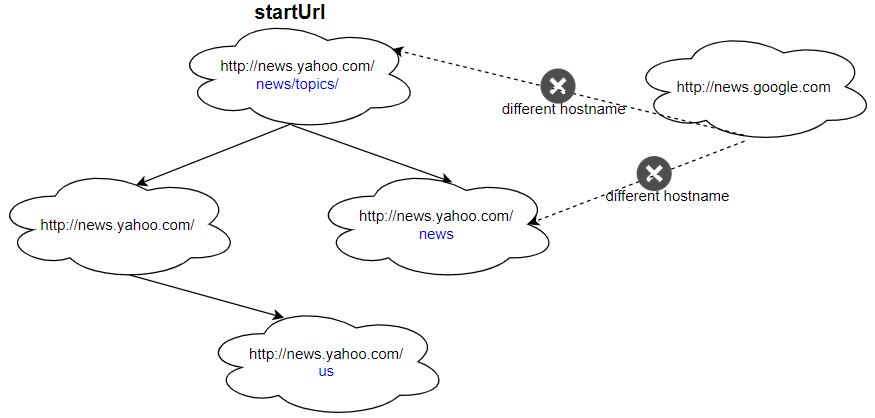
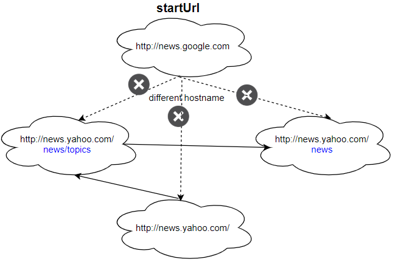

Can you solve this real interview question? Web Crawler Multithreaded - Given a URL startUrl and an interface HtmlParser, implement a Multi-threaded web crawler to crawl all links that are under the same hostname as startUrl.

Return all URLs obtained by your web crawler in any order.

Your crawler should:

 * Start from the page: startUrl
 * Call HtmlParser.getUrls(url) to get all URLs from a webpage of a given URL.
 * Do not crawl the same link twice.
 * Explore only the links that are under the same hostname as startUrl.

As shown in the example URL above, the hostname is example.org. For simplicity's sake, you may assume all URLs use HTTP protocol without any port specified. For example, the URLs http://leetcode.com/problems and http://leetcode.com/contest are under the same hostname, while URLs http://example.org/test and http://example.com/abc are not under the same hostname.

The HtmlParser interface is defined as such:

interface HtmlParser {
  // Return a list of all urls from a webpage of given url.
  // This is a blocking call, that means it will do HTTP request and return when this request is finished.
  public List<String> getUrls(String url);
}

Note that getUrls(String url) simulates performing an HTTP request. You can treat it as a blocking function call that waits for an HTTP request to finish. It is guaranteed that getUrls(String url) will return the URLs within 15ms. Single-threaded solutions will exceed the time limit so, can your multi-threaded web crawler do better?

Below are two examples explaining the functionality of the problem. For custom testing purposes, you'll have three variables urls, edges and startUrl. Notice that you will only have access to startUrl in your code, while urls and edges are not directly accessible to you in code.

 

Example 1:

Input:
urls = [
  "http://news.yahoo.com",
  "http://news.yahoo.com/news",
  "http://news.yahoo.com/news/topics/",
  "http://news.google.com",
  "http://news.yahoo.com/us"
]
edges = [[2,0],[2,1],[3,2],[3,1],[0,4]]
startUrl = "http://news.yahoo.com/news/topics/"
Output: [
  "http://news.yahoo.com",
  "http://news.yahoo.com/news",
  "http://news.yahoo.com/news/topics/",
  "http://news.yahoo.com/us"
]

Example 2:

Input: 
urls = [
  "http://news.yahoo.com",
  "http://news.yahoo.com/news",
  "http://news.yahoo.com/news/topics/",
  "http://news.google.com"
]
edges = [[0,2],[2,1],[3,2],[3,1],[3,0]]
startUrl = "http://news.google.com"
Output: ["http://news.google.com"]
Explanation: The startUrl links to all other pages that do not share the same hostname.

 

Constraints:

 * 1 <= urls.length <= 1000
 * 1 <= urls[i].length <= 300
 * startUrl is one of the urls.
 * Hostname label must be from 1 to 63 characters long, including the dots, may contain only the ASCII letters from 'a' to 'z', digits from '0' to '9' and the hyphen-minus character ('-').
 * The hostname may not start or end with the hyphen-minus character ('-'). 
 * See:  https://en.wikipedia.org/wiki/Hostname#Restrictions_on_valid_hostnames [https://en.wikipedia.org/wiki/Hostname#Restrictions_on_valid_hostnames]
 * You may assume there're no duplicates in the URL library.

 

Follow up:

 1. Assume we have 10,000 nodes and 1 billion URLs to crawl. We will deploy the same software onto each node. The software can know about all the nodes. We have to minimize communication between machines and make sure each node does equal amount of work. How would your web crawler design change?
 2. What if one node fails or does not work?
 3. How do you know when the crawler is done?

---

## Images

- Image 1: `image_1.png`
- Image 2: `image_2.png`
- Image 3: `image_3.png`
